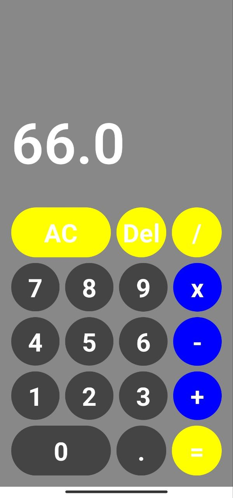

# Калькулятор на Jetpack Compose

<!-- Описание проекта -->
Простой калькулятор, разработанный на языке Kotlin с использованием Jetpack Compose и архитектуры MVVM. Проект использует `viewModel` для управления логикой представления.



## Основные технологии
- **Jetpack Compose:** Современный фреймворк для создания пользовательских интерфейсов в приложениях Android.
- **Kotlin:** Компактный и выразительный язык программирования для платформы Java.
- **MVVM:** Архитектурный шаблон, обеспечивающий отделение бизнес-логики от пользовательского интерфейса.

## Как начать использовать
1. Склонируйте репозиторий на свой компьютер.
2. Откройте проект в вашей IDE.
3. Запустите приложение на эмуляторе или физическом устройстве.

## Пример кода
```kotlin
// Пример использования Jetpack Compose для создания простого калькулятора
@Composable
fun CalculatorScreen() {
    // Ваш код Jetpack Compose 
}
